<p align="center">
  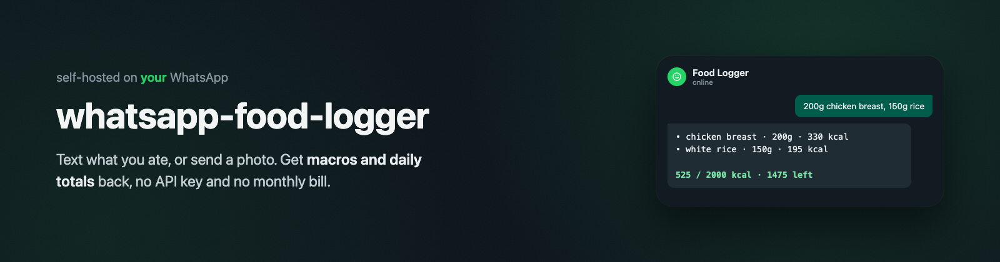
</p>

<p align="center">
  <b>Log calories and macros by texting WhatsApp. Self-hosted, no API key, no monthly AI bill.</b>
</p>

<p align="center">
  <a href="https://github.com/padisaputra/whatsapp-food-logger/actions/workflows/ci.yml"></a>
  
  
</p>

Text it what you ate, or send a photo of a meal or a nutrition label, and it
replies with the estimated macros plus your totals for the day against your
targets. Built as a template for a personal trainer running it for a handful
of clients, but works just as well solo.

```
you: 200g grilled chicken breast, 150g white rice
bot: • grilled chicken breast · 200g · 330 kcal · P62 C0 F7
     • white rice · 150g · 195 kcal · P4 C42 F0.5

     525 / 2000 kcal (1475 left) · P 66/150g · C 42/200g · F 7.5/65g
```

<p align="center">
  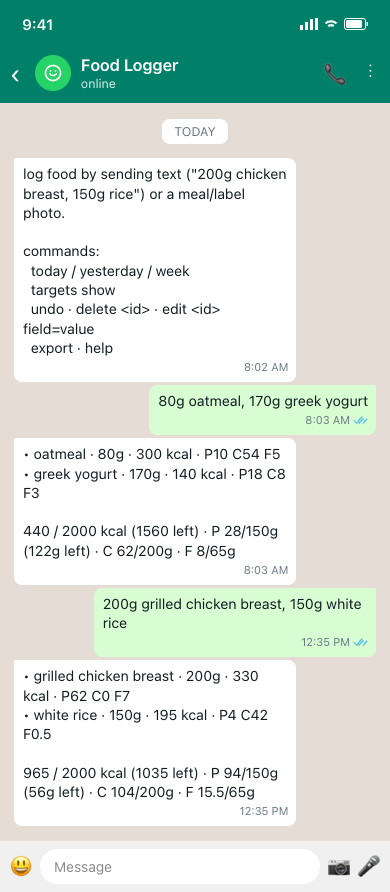
  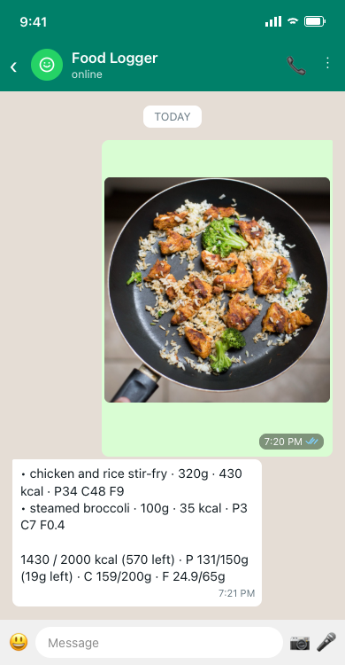
  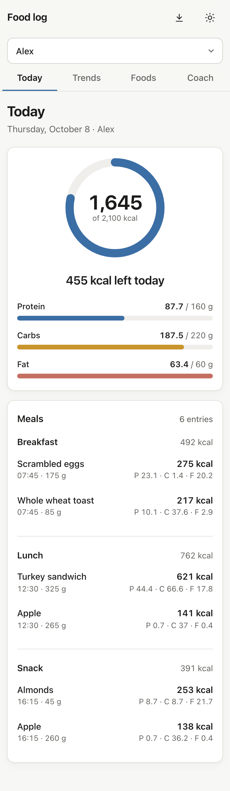
</p>

## What it does

- **Logs food from text or a photo.** `"200g chicken breast, 150g rice"` or a
  photo of a meal or a nutrition-label screenshot both work the same way.
- **Replies with macros and running totals**, every time, in the same chat
  you already use. No app to open.
- **Runs on your own Claude subscription**, through the Claude Code CLI you
  log into once. No API key, no per-message bill.
- **Coach mode for trainers.** One admin number can add, pause, or remove
  clients by WhatsApp number, each with their own log and targets, plus a
  [web dashboard](docs/DASHBOARD.md) for trends and adherence.

  <p>
    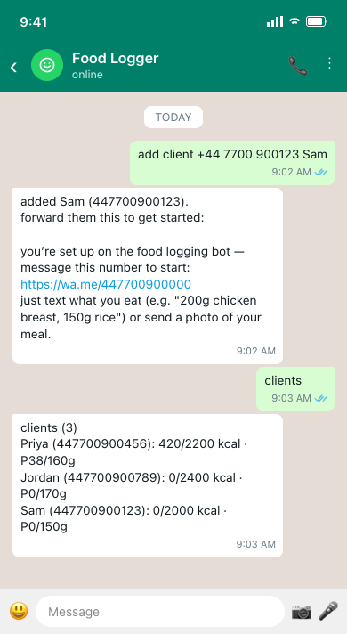
    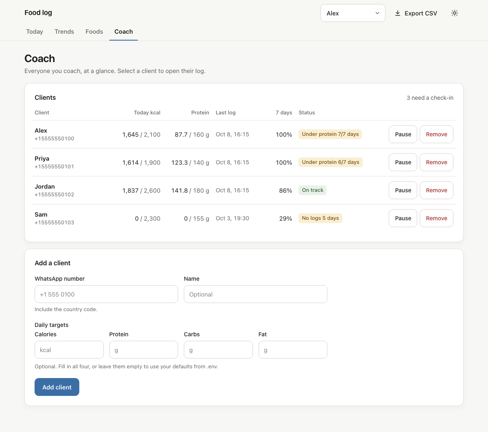
  </p>

## How it works

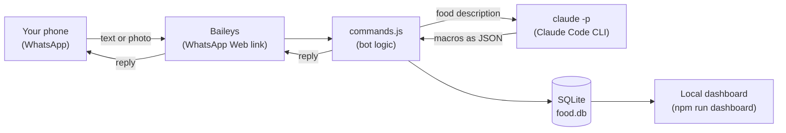

Everything runs on one computer you control: Baileys links to WhatsApp the
same way WhatsApp Web does, your message goes to `commands.js` for parsing,
food descriptions get analyzed by your own `claude -p` session, and the
result is stored in a local SQLite file the dashboard reads from.

## Requirements

- A Mac or PC that can stay on and connected most of the time (a phone
  cannot run this).
- [Node.js](https://nodejs.org) 22 or newer (`better-sqlite3`'s native binary requires it).
- A Claude Pro or Max subscription, with the
  [Claude Code CLI](https://claude.com/claude-code) installed and logged in.
- A spare WhatsApp number is strongly recommended over your main one, see
  [Limitations](#limitations).

## Quick start

Five minutes, start to finish.

**1. Log into the Claude Code CLI** (only needed once, ever, on this machine):

```bash
claude
```

Follow the login prompt, then `/exit`. The bot reuses this login.

**2. Clone and install:**

```bash
git clone https://github.com/padisaputra/whatsapp-food-logger.git
cd whatsapp-food-logger
npm install
```

**3. Run the setup wizard:**

```bash
npm run setup
```

It checks your Node version and Claude CLI login, asks for the WhatsApp
number(s) allowed to use the bot, your timezone, your daily targets, and the
bot's own WhatsApp number (use a spare number, not your main one), then
writes `.env` for you.

**4. Link WhatsApp.** Right after the questions, an 8-character pairing code
prints in the terminal:

<p>
  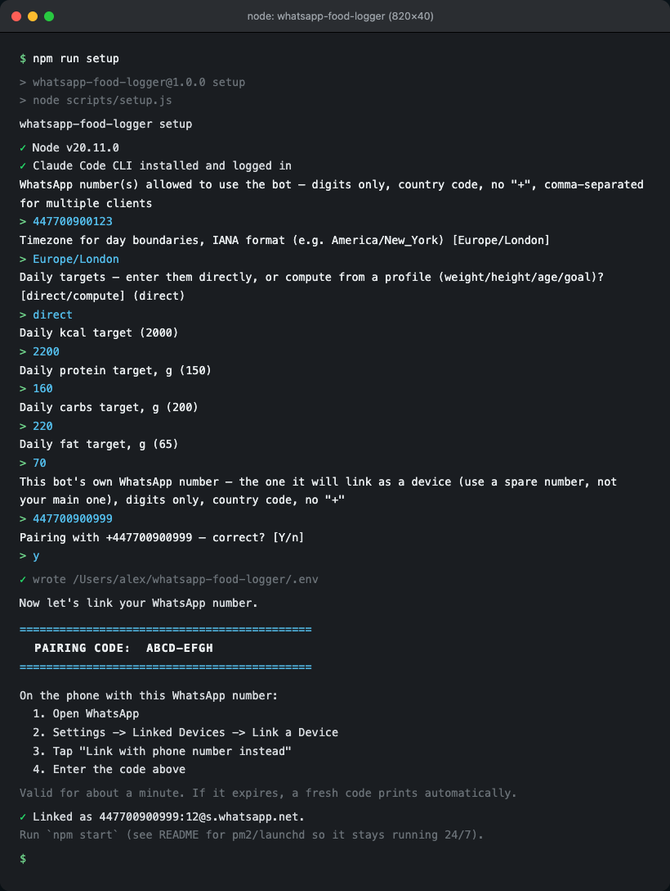
</p>

On the phone with that number: **WhatsApp → Settings → Linked Devices → Link
a Device → Link with phone number instead**, then type in the code. It's
valid for about a minute, if it expires the terminal prints a fresh one
automatically. (Full steps: [docs/SETUP.md](docs/SETUP.md#4-link-whatsapp).)

**5. Start the bot:**

```bash
npm start
```

Text it from your phone: `200g chicken breast, 150g rice`, or send a photo
of a meal. You'll get macros and a running total back in the same chat
within a few seconds. Stop it anytime with `Ctrl+C`.

Running this for more than yourself, or want it to survive a restart? See
[docs/SETUP.md](docs/SETUP.md) for coach mode, pm2/launchd/systemd, and
relinking.

## Commands

**Anyone allowed to use the bot:**

| Message | Effect |
|---|---|
| `200g chicken breast, 150g rice` | Logs food from text |
| *(a photo)* | Logs food from a meal photo or a nutrition-label screenshot |
| `today` / `yesterday` / `week` | Totals vs. targets |
| `targets show` | Shows your current targets |
| `targets set 2200 160 220 70` | Sets kcal, protein_g, carbs_g, fat_g |
| `undo` | Removes the most recently logged entry |
| `delete 12` | Removes entry #12 (see ids via `export`) |
| `edit 12 grams=250 kcal=400` | Edits one or more fields on an entry |
| `export` | Sends your full log as a CSV file |
| `help` | Lists commands (adds coach commands below, if you're the admin) |

**Coach/admin number only** (set `COACH_NUMBER` in `.env`, or during setup):

| Message | Effect |
|---|---|
| `add client 447700900123 Priya` | Adds a client, replies with an invite to forward |
| `clients` | Roster with everyone's kcal/protein today |
| `client Priya targets 2200 160 220 70` | Sets that client's targets |
| `pause client Priya` / `resume client Priya` | Blocks/unblocks without losing data |
| `remove client Priya` | Blocks and drops from the roster, data kept |
| `delete client data Priya confirm` | Permanently deletes that client's data |
| `coach summary` | Today's totals for every client |

Full reference with every option and example: [docs/COMMANDS.md](docs/COMMANDS.md).

## Coach mode and adding clients

Turn on coach mode during `npm run setup` (it asks once you enter more than
one number), or any time by setting `COACH_NUMBER` in `.env`. The coach
number can then add clients straight from WhatsApp, no `.env` edits or
restarts:

<p align="center">
  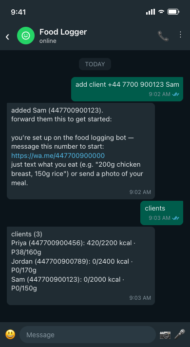
</p>

`add client <number> [name]` replies with a ready-to-forward invite message
(a `wa.me` link) so the client messages the bot first, which is the safer
direction for an unofficial WhatsApp client (see
[Limitations](#limitations)). Add `--welcome` to have the bot message the
new client directly instead. The same add/pause/resume/remove actions are
also available as buttons on the [dashboard's Coach tab](docs/DASHBOARD.md#coach-actions-writes).

## Dashboard

A local web dashboard over the bot's SQLite database: trends, macros, and
adherence without scrolling back through chat history.

<p align="center">
  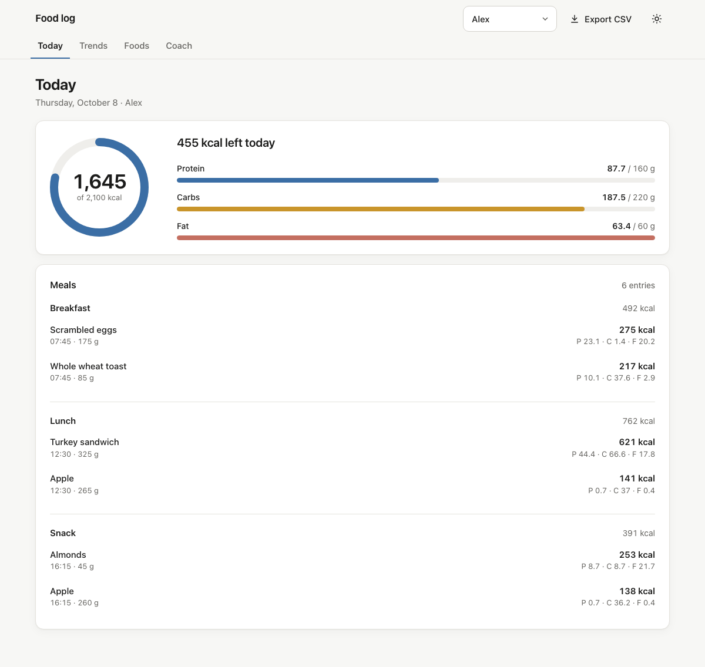
</p>
<p align="center">
  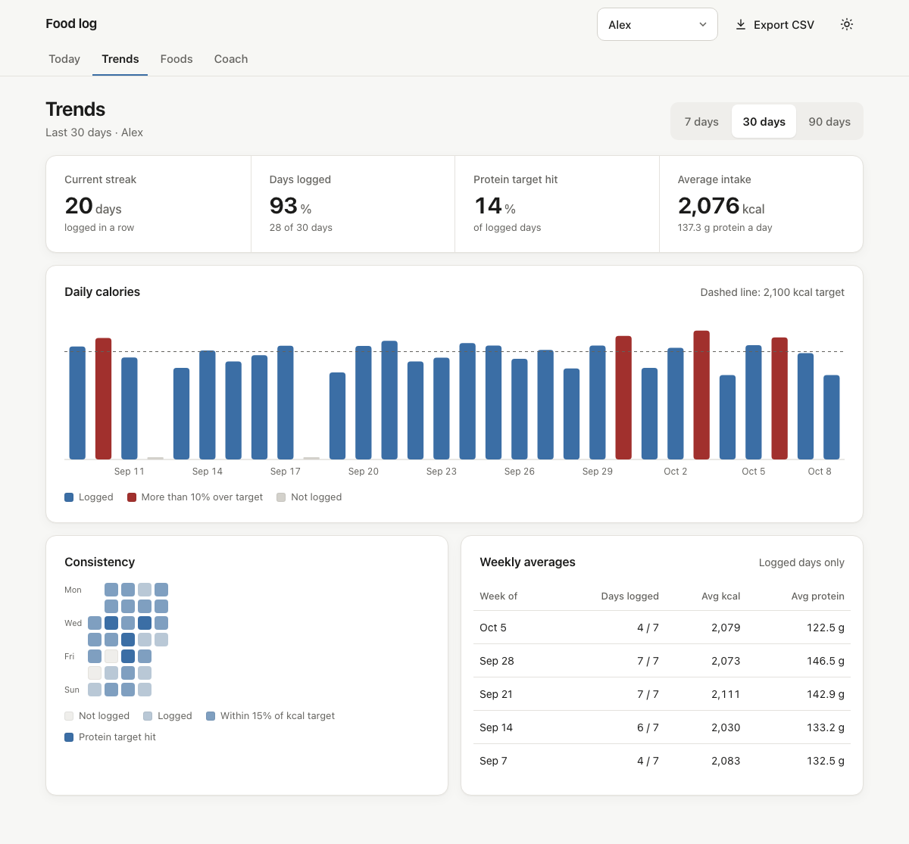
</p>

```bash
npm run dashboard
```

Opens at `http://127.0.0.1:4870`. See [docs/DASHBOARD.md](docs/DASHBOARD.md)
for the full view guide, the Coach tab's add/pause/resume/remove actions,
and how to open it on your phone over Tailscale.

## Running it 24/7

A closed terminal stops the bot. For anything beyond trying it out, run it
under a process manager so it survives a restart:

```bash
npm install -g pm2
pm2 start src/index.js --name food-logger
pm2 save
pm2 startup
```

launchd (Mac, auto-start on login) and systemd (Linux) options, plus
relinking WhatsApp if it gets logged out, are in
[docs/SETUP.md](docs/SETUP.md#running-it-247).

## Troubleshooting / FAQ

Short version: check `ALLOWED_NUMBERS`/the client roster if the bot ignores
a message, raise `CLAUDE_TIMEOUT_MS` if photos time out, run `npm run
relink` if WhatsApp says you're logged out. Full troubleshooting steps and
answers to "can I use my main number", "how accurate are the estimates",
and more: [docs/FAQ.md](docs/FAQ.md).

## Privacy

- Everything lives locally: the food log in `./data/food.db` (SQLite),
  logged photos in `./data/photos/`, your WhatsApp session in `./auth/`.
  Nothing is uploaded anywhere by this bot.
- Each message is analyzed by your own Claude Code CLI session, under your
  own subscription, governed by Anthropic's terms, not a separate
  third-party API.
- Only numbers in the client roster are answered. Everyone else is ignored
  and never stored. The bot's own logs never include message text or photo
  contents.
- `.env`, `./data/`, and `./auth/` are gitignored, so none of this ends up
  committed if you fork or back up the code.

## WhatsApp ToS caveat

This bot connects to WhatsApp the same unofficial way WhatsApp Web does
(via [Baileys](https://github.com/WhiskeySockets/Baileys)), not WhatsApp's
official Business API. That can violate WhatsApp's Terms of Service, with
some risk of the linked number being limited. Use a spare number, not your
main one.

## Limitations

- Macro estimates, especially from photos, are estimates. This is a
  convenience tool, **not medical or nutritional advice**.
- The AI can misidentify foods or misread labels. Spot-check anything that
  looks off and use `edit` / `delete` to correct it.
- See the WhatsApp ToS caveat above before linking your main number.

## For developers

Stack, code layout, database schema, and how to run the test suite: see
[docs/SETUP.md](docs/SETUP.md#for-developers). Changes are tracked in
[CHANGELOG.md](CHANGELOG.md).

## Credits

The meal photo in the screenshots above: [Keegan Evans on Pexels](https://www.pexels.com/photo/white-rice-chicken-and-broccoli-on-black-non-stick-pan-105588/).

## License

MIT, see [LICENSE](./LICENSE).
